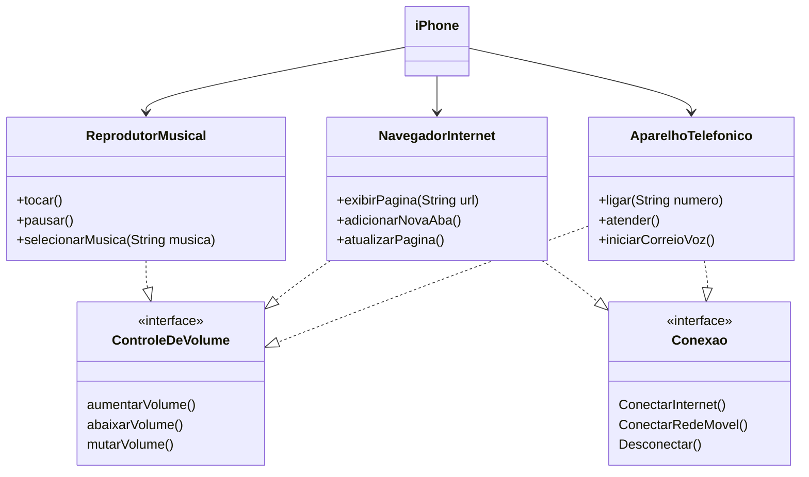

### Modelagem e Diagramação de um Componente iPhone
## Autor
- [Lucas Sampaio](https://github.com/Like-a-stone)

```mermaid
classDiagram
    class ReprodutorMusical {
        +tocar()
        +pausar()
        +selecionarMusica(String musica)
    }

    class AparelhoTelefonico {
        +ligar(String numero)
        +atender()
        +iniciarCorreioVoz()
    }

    class NavegadorInternet {
        +exibirPagina(String url)
        +adicionarNovaAba()
        +atualizarPagina()
    }

    class iPhone {
    }

    class Conexao
    <<interface>> Conexao
    Conexao : ConectarInternet()
    Conexao : ConectarRedeMovel()
    Conexao : Desconectar()

    class ControleDeVolume
    <<interface>> ControleDeVolume
    ControleDeVolume : aumentarVolume()
    ControleDeVolume : abaixarVolume()
    ControleDeVolume : mutarVolume()

    iPhone --> ReprodutorMusical
    iPhone --> AparelhoTelefonico
    iPhone --> NavegadorInternet

    ReprodutorMusical ..|> ControleDeVolume
    NavegadorInternet ..|> Conexao
    NavegadorInternet ..|> ControleDeVolume
    AparelhoTelefonico ..|> ControleDeVolume
    AparelhoTelefonico ..|> Conexao
```